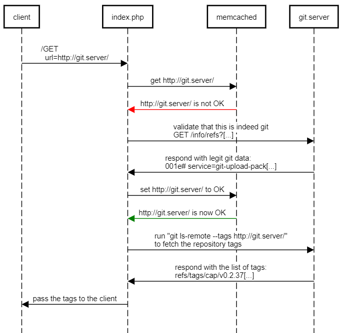
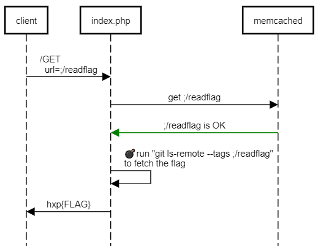
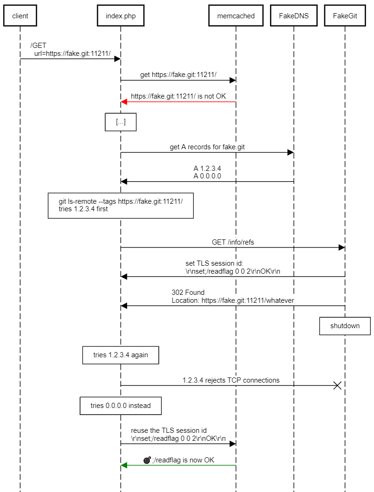

This is a "security scanner" in PHP which, given a URL of a git repository, applies a heuristic algorithm that checks if there
any security vulnerabilites in the code:
```php
if(TRUE) { // patented algorithm (tm)
    echo 'Likely insecure :('; 
}
```
...hard to argue with that!

Once again, our goal is to execute the `/readflag` binary on the server to read the flag.

The PHP application visits the given URL twice:
  1. (using `file_get_contents(URL)`) To validate that this is a legitimate git server. The validation results for all URLs are stored in memcached.
  2. (using `git ls-remote`) To actually fetch the tags of the repository.

Here's a visualization of what happens when we put a legitimate git repository in the scanner:



Since `git ls-remote` is run with `exec()`, a rogue "URL" in memcached is an instant Game Over for the challenge authors:



How can we successfully "validate" `;/readflag`, though? Initially it seems like we can't, because:
  1. A valid URL should match `/^[0-9a-zA-Z:\.\/-]{1,64}$/`, and `;/readflag` definitely doesn't. The code uses `preg_match()`, so we can't
  use UTF-8 shenanigans as in [heiko](shenanigans), either.
  2. Even if the regular expression matched, `;/readflag` is not a valid URL that `file_get_contents()` would recognize.
  
The good news is the memcached protocol is [notoriously vulnerable](https://www.blackhat.com/docs/us-14/materials/us-14-Novikov-The-New-Page-Of-Injections-Book-Memcached-Injections-WP.pdf) to injections.
Essentially, if we can make either `file_get_contents()` or `git ls-remote` connect to `127.0.0.1:11211` and send some `\r\n`'s, we win.

Smuggling CRLFs into memcached proves to be surprisingly tricky:
  * HTTP(S) implementations both in PHP and libcurl (which is what `git` uses under the hood) have protections against request splitting
  and won't let us use `\r\n` in a valid HTTP request. We tried various ways, and none of those worked.
  * FTP is of not much help here, unlike in [resonator](https://github.com/dfyz/ctf-writeups/tree/master/hxp-2020/heiko). While we still redirect the
  FTP client to 127.0.0.1, this time we can only retrieve data, not store it.
  * Smuggling newlines in the FTP username fails, too, due to the regexp that validates the URL.

Just when it seems that all hope is lost, [TLS Poison](https://github.com/jmdx/TLS-poison) appears! Brifely, a TLS server may
set a session ID for the client, which the client may pass to the server on subsequent connections to re-use the same premaster
secret they had used before to encrypt the traffic. This ID is stored in the clear in the very first TLS handshake packet the client
sends to the server.

However, most TLS stacks only look at the host/port when determining if
a session ID should be reused. This means that if a malicious HTTPS server redirects the client to itself, but the same host now suddenly
resolves to `127.0.0.1`, the client will still happily send the session ID to whatever local service is listening locally on this port
(spoler: it's memcached). The session ID is just random 32 bytes, so we can easily pack `\r\n` into it.

`file_get_contents()` in PHP doesn't seem to re-use TLS session IDs, so our implementation of this attack targets git/libcurl
and does it little bit differently from vanilla TLS Poison:



First, a [custom rustls fork](https://github.com/jmdx/TLS-poison/tree/master/rustls) is an overkill for CTF purposes. If we're willing
to cut some corners (e.g., don't use ephemeral Diffie-Hellman or any extensions), we can create a simple TLS server in [~200 line of Python](https://github.com/dfyz/ctf-writeups/blob/master/hxp-2020/security%20scanner/fake_git.py#L196).

Second, libcurl aggressively caches DNS lookup results for 60 seconds, even for DNS records with zero TTL. This means
the standard DNS rebinding technique doesn't work, since curl will just reconnect to the same server after a HTTP redirect.
To overcome this, we return two A records for our fake git servers: the first one is a real IP address, the second one is `0.0.0.0`.
After serving the HTTP redirect, we immediately shutdown the server, so that libcurl thinks it's dead and tries `0.0.0.0` instead,
which will lead it to memcached. Note that we can't return an A record with `127.0.0.1` directly, since `gethostbyname()`
reorders the resolved addresses, which results in libcurl trying `127.0.0.1` first, which is not what we want.

(incidentally, this means we don't really need a custom DNS resolver at all, but hey, it's only [~100 lines](https://github.com/dfyz/ctf-writeups/blob/master/hxp-2020/security%20scanner/fake_dns.py) of Python)

Armed with fake DNS and fake TLS, we [obtain the flag](https://github.com/dfyz/ctf-writeups/blob/master/hxp-2020/security%20scanner/exploit.py):
```
PS > python .\exploit.py
Got PHP cookie jbi3rvhrau92u8q6p5t9kgkhtd and sandbox id Kmr66tPXgpPxYA
Poisoning memcached
Memcached is poisoned, reading flag
hxp{Bundesamt_fuer_Sicherheit_in_der_Informationstechnik_(_lol_)_would_approve}
```

For completeness, here is the output from FakeTLS:
```
Got client hello
Sent server hello with session id b''
Sent 2 certificates
Sent server hello done
Got a premaster secret
Got client finished
Sent server finished, the connection is ready
Got a message of length 118
This is PHP! Showing them something that looks like a git repo and stealing sandbox ID
Got sandbox id: b'*j\xfa\xea\xd3\xd7\x82\x93\xf1`', session_id: b'\r\nset *j\xfa\xea\xd3\xd7\x82\x93\xf1`;/r* 0 0 2\r\nOK\r\n'
Sent a message of length 118
Got client hello
Sent server hello with session id b'\r\nset *j\xfa\xea\xd3\xd7\x82\x93\xf1`;/r* 0 0 2\r\nOK\r\n'
Sent 2 certificates
Sent server hello done
Got a premaster secret
Got client finished
Sent server finished, the connection is ready
Got a message of length 186
This is git! Redirecting it back to memcached and shutting down
Sent a message of length 138
Laying low for 5 seconds so that the git client doesn't reconnect to us
```

P.S. Some of the minor details were omitted for clarity in this writeup:
  * the memcached instance was shared between the teams during the CTF, so the security scanner prepends a "sandbox ID" at the beginning of memcached keys.
  The sandox ID is different for each team and is stored in the PHP session;
  * with the sandbox ID in place, `;/readflag` is actually too long to fit in the TLS session id and has to be shortened to `;/r*` (we're lucky that there are no other binaries starting with `r` in `/`).
