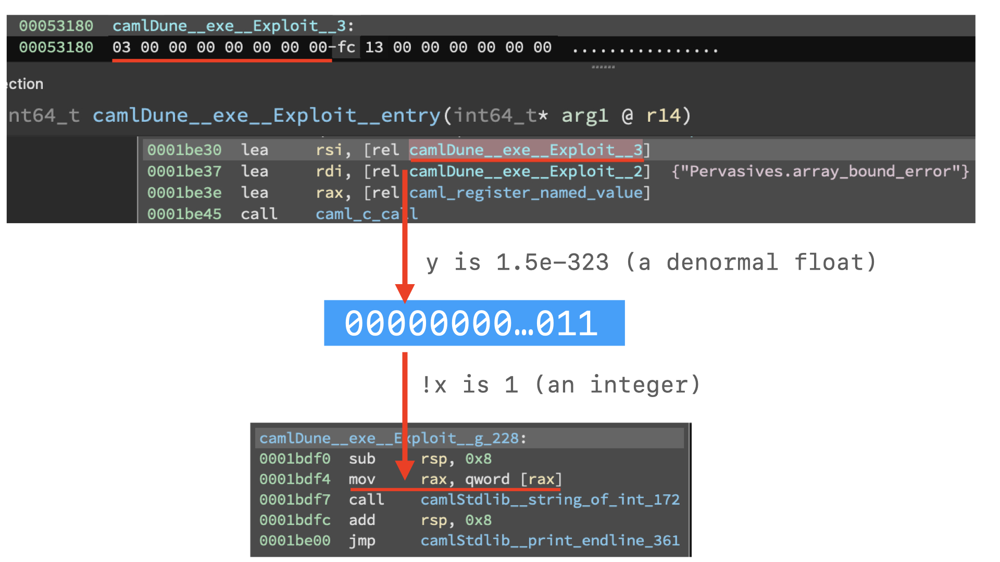
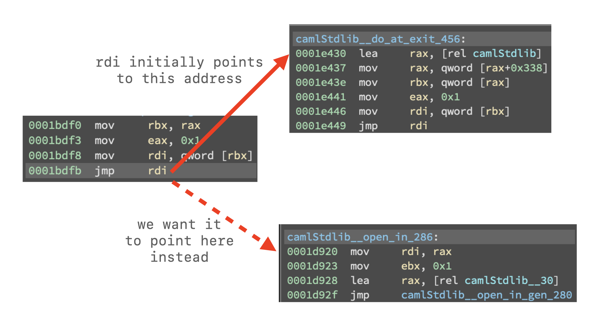

Secure OCaml Sandbox
---

Our objective in this `pwn` challenge from [PlaidCTF 2021](https://ctftime.org/event/1199) is to upload an arbitrary OCaml program that reads the flag from `/flag` and prints it to stdout.
That wouldn't be very interesting if it wasn't for the heavily restricted version of the standard library our program is sandboxed with:
```ocaml
open struct
  let blocked = `Blocked

  module Blocked = struct
    let blocked = blocked
  end
end

module Fixed_stdlib = struct
  let open_in = blocked
  let open_in_bin = blocked
  let open_in_gen = blocked
  (* ...~150 more similar lines... *)
end

include Fixed_stdlib
```

Pretty much everything even tangentially related to IO is mercilessly stripped away.
Unsafe functions, such as `Array.unsafe_get`, which could allow us to subvert the type system and execute arbitrary code, are also banned.

So, how do we escape the sandbox to read the flag?

Before we get to the final exploit, I want to briefly discuss a couple of unintended solutions,
and also our failed attempts at breaking out of the sandbox. If you're only interested in the solution our team came up with, you can jump directly to that.

Insecure OCaml Sandbox
---

The first unintended solution was discovered during the event by some of the teams. PPP published a fixed version promptly,
and the diff with the original version is mostly self-explanatory:
```diff
--- sos/main	2021-04-12 09:28:12.000000000 +0500
+++ sos-mirage/main	2021-04-17 03:48:57.000000000 +0500
@@ -7,6 +7,6 @@
 	exit 1
 fi
 
-echo "open! Sos" > user/exploit.ml
+echo "open! Sos;;" > user/exploit.ml
 cat /input/exploit.ml >> user/exploit.ml
 dune exec user/exploit.exe
```

`open! Sos` is the line prepended to your program to make it use the sandboxed standard library.
Without the trailing `;;`, you could start the malicious program with something like `.Fixed_uchar`
to only import one of the submodules of the patched standard library instead of the whole deal.
The rest is trivial.

The second unintended (I believe) solution comes from [SECCON 2020 writeups](https://moraprogramming.hateblo.jp/entry/2020/10/14/185946), which apparently
had a challenge named `mlml` with an even stonger OCaml sandbox. Their reference solution uses the unsound implementation of pattern matching in
the OCaml compiler to achieve RCE. While extremely clever and cool, I doubt that PPP wanted us to essentially copy/paste an existing snippet of code
with minor modifications. Besides, there's little point in elaborately patching the stdlib if all you wanted to target was the compiler.


Fumbling around
---

Blissfully unaware of both unintended solutions, we tried the following approaches during the CTF, all of which failed:
  * Calling libc functions directly from OCaml. This was out of question, because the runner script (`main` from the above) straight up rejects any program containing `external` (the OCaml [keyword](https://ocaml.org/manual/intfc.html) for FFI) as a substring.
  * Trying to find any `unsafe` functions that slipped through the sandbox. There was indeed at least [one](https://github.com/ocaml/ocaml/blob/4.10/stdlib/array.ml#L28), but it proved impossible to use, as the same runner script also refused to run any program containing `unsafe`.
  * Abusing `Digest.file`, which wasn't banned and allowed us to compute MD5 of an arbitrary file. Later, it turned out that another team actually came up with an [ingenious solution](http://eternal.red/2021/secure-ocaml-sandbox/) using `Digest.file`, but we failed to extract anything useful out of this primitive.
  * Using the `OO` module, which in particular has a tempting `new_method` function that is marked as `[...] for system use only. Do not call directly.`. In fact, [the implementation](https://github.com/ocaml/ocaml/blob/4.10/stdlib/camlinternalOO.ml#L70) doesn't create any methods and consists of boring string manipulations.
  * Leaking the flag through `Lexing.position`, which describes `a point in a source file` and has a `pos_fname` field, which references a file. This also proved to be a dead-end, since `Lexing` doesn't do anything interesting with `pos_fname`.
  * Exploiting [unsoundness](https://github.com/ocaml/ocaml/issues/9391) in `Ephemeron`. This seemed quite promising, since we were able to reliably segfault the sample program from the issue description. However, we didn't explore it further, because at this moment...


It all comes together
---
...we hit [the jackpot](https://github.com/ocaml/ocaml/blob/4.10/stdlib/callback.mli#L23): `Callback.register`. It stores an arbitrary value (typically a function) under a certain `name`. The OCaml C runtime can then retrieve and use the value via `caml_named_value(name)`. Crucially, it's on the programmer to
ensure that all values and function signatures use the correct types. Type mismatches result in undefined behavior and spectacular segfaults, which is exactly what we need for our exploit.

Looking at usages of `caml_named_value()` in the OCaml runtime, we found a perfect match:
  * [`Printexc.handle_uncaught_exception`](https://github.com/ocaml/ocaml/blob/4.10/runtime/printexc.c#L143) allows us to register a handler for an unhandled exception. The handler receives a pointer to the uncaught exception as its first parameter.
  * [`Pervasives.array_bound_error`](https://github.com/ocaml/ocaml/blob/4.10/runtime/fail_nat.c#L192) allows us to override the singleton object the runtime uses to represent the exception that is raised whenever we overstep array bounds.

Combining these two, we craft us a type confusion primitive: register an object of type `A` as `Pervasive.array_bound_error`, then use it as an object of type `B ref` in the exception handler for out-of-bounds accesses. Here's a quick demo with `A = float, B = int`:
```ocaml
let oob () = "".[1]

let y = 1.5E-323;;
let g (x: int ref) _ = print_endline (string_of_int !x);;

Callback.register "Pervasives.array_bound_error" y;
Callback.register "Printexc.handle_uncaught_exception" g;
oob ()
```

Both `y` and `!x` have the same bit representation, but different types and hence different values:



Notice that even though the bit pattern was `00...011`, `g` prints `1` instead of the more expected `3`. Turns out that OCaml unboxes integers for performance and stores them [`shifted left by 1 bit, with the least significant bit set to 1`](https://dev.realworldocaml.org/runtime-memory-layout.html#table20-1_ocaml) to distinguish them from object references. This is going to be somewhat important for our exploit.

With all the necessary machinery in place, the idea of the exploit is straightforward:
  * a function call is essentially dereferencing a pointer;
  * we obtain a pointer to one of the benign, boring functions from the stdlib, e.g. `do_at_exit`;
  * reinterpret the function pointer as an integer and add a statically known offset to make the pointer point at an evil 𝔽𝕆ℝ𝔹𝕀𝔻𝔻𝔼ℕ function, e.g. `open_in`;
  * convert the integer back to a function pointer by registering a second callback;
  * use `open_in` to open and read the flag.

The same thing, but in a picture:




And finally, the code, which is not that different from the demo above:
```ocaml
let print_flag do_open _ = print_endline (input_line (do_open "/flag"))
let oob () = "".[1]

let g exit _ =
    exit := !exit - 1416;
    Callback.register "Printexc.handle_uncaught_exception" print_flag;
    oob ();;

Callback.register "Pervasives.array_bound_error" do_at_exit;
Callback.register "Printexc.handle_uncaught_exception" g;
oob ()
```

The only catch is that the difference between `do_at_exit` and `open_in` is `2832` bytes, but we have to use half of that in the exploit (remember the way integers are stored in OCaml?).

All in all, this challenge was surprisingly exciting and elegant (if a little undertested). I'm generally wary of "escape the sandbox" tasks, but this one managed to have just the right amount of `pwn` and the right amount of sandbox. Kudos to the creators!
